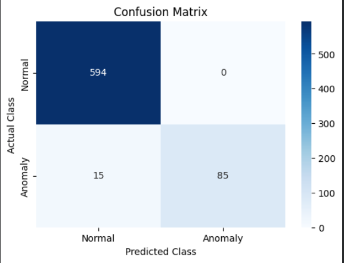

# Guardian: An AI-Powered Autonomous Failure Prevention System for CubeSats

**Project for the IEEE IAS & AESS Challenge**
**Author:** mouhibfarhat

## 1. Project Goal

The Guardian is a fully autonomous, electronic subsystem designed to increase the mission success rate of CubeSats. It addresses the two most common causes of catastrophic mission failure—**On-Board Computer (OBC) freezes** and **Electrical Power System (EPS) failures**—by using a combination of hardware-level monitoring and a predictive AI model to detect and intervene in failure scenarios before they become unrecoverable.

This system operates independently, requires no ground support, and is designed to be a "guardian angel" that ensures the CubeSat remains operational.

## 2. System Architecture

The Guardian's architecture is built on a principle of robust simplicity. A dedicated **Guardian Controller** (the brain) monitors the host CubeSat's **OBC** and **EPS** (the patients) using a dedicated **Sensing Array**. If a fault is detected or predicted, it uses its **Intervention Hardware** to take immediate corrective action.


## 3. How It Works

The Guardian protects against two primary failure scenarios:

### Scenario 1: On-Board Computer (OBC) Freeze Detection

*   **Problem:** The main computer freezes due to a software bug or a radiation-induced Single Event Upset (SEU), rendering the satellite unresponsive.
*   **Guardian's Solution:**
    1.  **Monitor:** The Guardian listens for a "heartbeat" signal—a simple blinking light (GPIO pin toggle)—from the OBC.
    2.  **Detect:** If the heartbeat signal stops changing for more than 10 seconds, the Guardian declares the OBC frozen.
    3.  **Intervene:** It immediately sends a signal to a MOSFET, which pulls the OBC's hardware `RUN` pin to ground, forcing a hard reboot and clearing the frozen state.

### Scenario 2: Battery Thermal Runaway Prediction

*   **Problem:** The battery begins to dangerously overheat, risking a fire that would destroy the entire satellite.
*   **Guardian's Solution:**
    1.  **Monitor:** The Guardian continuously reads real-time temperature and voltage data from the battery.
    2.  **Predict (AI):** A lightweight LSTM neural network, running on the Guardian controller, analyzes the time-series data. It is trained to recognize the subtle "pre-failure signature" of a thermal runaway event (e.g., a rapid temperature rise correlated with an anomalous voltage drop).
    3.  **Intervene:** If the AI model predicts a failure, the Guardian activates a relay to physically disconnect the battery from the rest of the spacecraft, preventing a catastrophic thermal event.

## 4. Components

This repository contains all the hardware designs, firmware, software, AI models, and documentation needed to build and test the Guardian system.

### 4.1. Hardware
The hardware is designed for rapid prototyping and validation.
*   **Guardian Controller:** Arduino Uno
*   **On-Board Computer (OBC):** Raspberry Pi
*   **Sensors:** TMP36 (temperature), 2:1 Voltage Divider (voltage)
*   **Actuators:** IRLZ44N N-Channel MOSFET (for OBC reset), 5V SPDT Relay (for power isolation)

All schematics and hardware documentation can be found in the `/hardware` directory.

### 4.2. Firmware & Software
*   **`Guardian_Controller.ino`:** The C++ firmware for the Arduino. It contains the main control loop, sensor reading logic, hardware intervention triggers, and the code to run the AI model.
*   **`obc_heartbeat_simulator.py`:** A Python script that runs on the Raspberry Pi to simulate the OBC's heartbeat signal. It can be stopped with `Ctrl+C` to test the Guardian's freeze-detection capability.

### 4.3. AI Model
The predictive core of the Guardian system is a highly optimized LSTM neural network.

*   **Architecture:** A single-layer LSTM with 8 units, designed for an extremely small memory footprint.
*   **Training:** The model was trained on a high-fidelity synthetic dataset that mimics both normal orbital conditions and the known physical signatures of battery thermal runaway.
*   **Performance:** The model achieved **98.13% accuracy** on the test set. The confusion matrix below shows its exceptional performance: it produced **zero false positives**, meaning it never incorrectly flagged a normal situation as an anomaly. It successfully detected 87% of all true anomalies.

 

*   **Deployment:** The model was converted using **TensorFlow Lite** and underwent **full integer quantization**. The final model is only **~2.5 KB**, making it small enough to run efficiently on the Arduino's resource-constrained microcontroller.

### 4.4. RTL Design (Path-to-Flight)
*   **`guardian_flight_model.v`:** To demonstrate a clear path toward a space-ready product, this Verilog file describes the Guardian's logic at the Register-Transfer Level (RTL). This serves as the blueprint for implementing the system on a radiation-tolerant FPGA for a real space mission.

## 5. Getting Started: How to Test the System

1.  **Hardware Setup:** Assemble the circuit according to the provided schematic.
2.  **Software Setup:**
    *   Upload the `Guardian_Controller.ino` sketch to your Arduino Uno. You will need to install the `Arduino_TensorFlowLite` library.
    *   On your Raspberry Pi, ensure you have Python and the `RPi.GPIO` library installed.
3.  **Running a Test (OBC Freeze):**
    *   Power on the system. Open the Arduino's Serial Monitor to view the Guardian's status telemetry.
    *   Run `python obc_heartbeat_simulator.py` on the Raspberry Pi. You should see "Heartbeat detected" messages in the Arduino serial monitor.
    *   Press `Ctrl+C` on the Raspberry Pi to stop the heartbeat script.
    *   Observe the Arduino's serial monitor. Within 10 seconds, it should detect the timeout and print "ACTION: Triggering OBC hardware reset."

```
